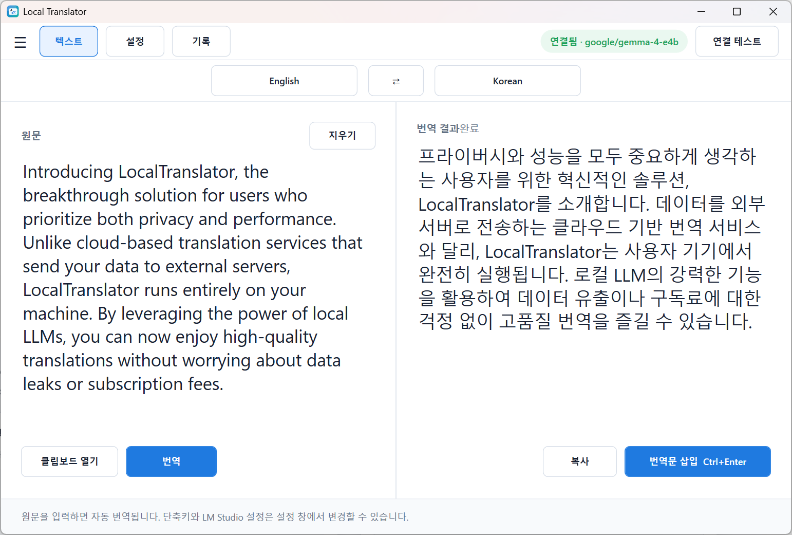
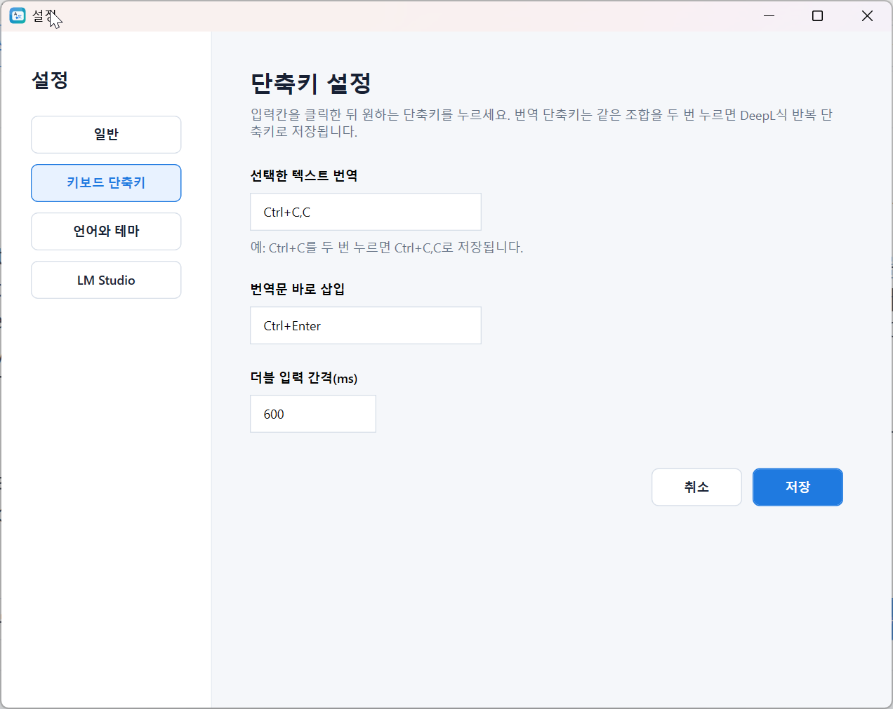
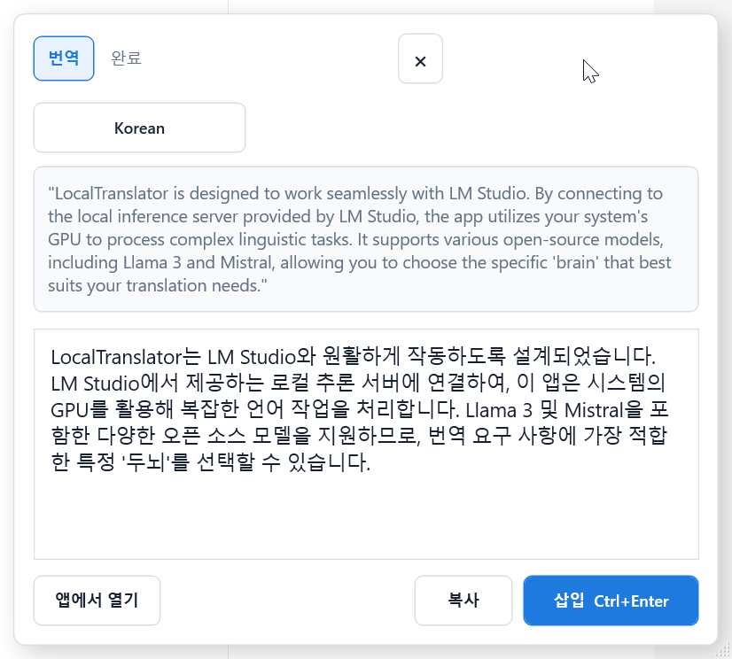

# Local Translator

Local Translator is a Windows translation app that works with a local LLM through LM Studio.

It is designed for a DeepL-like workflow: select text in any app, translate it in a floating window, review the result, then insert the translation back into the original app.

## Screenshots







## Download

Download the latest installer from GitHub Releases:

https://github.com/tz1012/LocalTranslator/releases/latest

Recommended file:

`LocalTranslator-v0.6.12-Setup.exe`

A portable zip is also available in the same release.

## Requirements

- Windows x64
- LM Studio installed
- A model loaded in LM Studio
- LM Studio local server enabled at:

```text
http://localhost:1234/v1
```

## Installation

1. Open the latest release page.
2. Download `LocalTranslator-v0.6.12-Setup.exe`.
3. Run the installer.
4. Start `Local Translator` from the Start menu or desktop shortcut.

This build is not code-signed yet, so Windows SmartScreen may show a warning on first launch.

## How To Use

1. Start LM Studio.
2. Load a translation-capable local model.
3. Enable LM Studio's local server.
4. Start Local Translator.
5. Select text in another app.
6. Press `Ctrl+C,C` to open the floating translation window.
7. Review the translation.
8. Press `Ctrl+Enter` to insert the translated text back into the original app.

## Default Shortcuts

- Translate selected text: `Ctrl+C,C`
- Insert translation: `Ctrl+Enter`

Shortcuts can be changed in the app settings.

## Main Features

- Local LLM translation through LM Studio
- Floating translation window
- Main translation workspace
- Insert translated text back into the source app
- Searchable language picker
- Clipboard text picker
- Custom translation instructions
- Configurable LM Studio endpoint, model, temperature, and max tokens
- Background tray mode

## Automatic Updates

Automatic update checks are supported from v0.6.

The app checks GitHub Releases from:

```text
tz1012/LocalTranslator
```

When a newer release is available, Local Translator can notify you from the tray and download the installer from GitHub Releases.

You can also check manually from the tray menu:

```text
Local Translator tray icon > 업데이트 확인
```

## Current Release

Latest release:

https://github.com/tz1012/LocalTranslator/releases/latest
